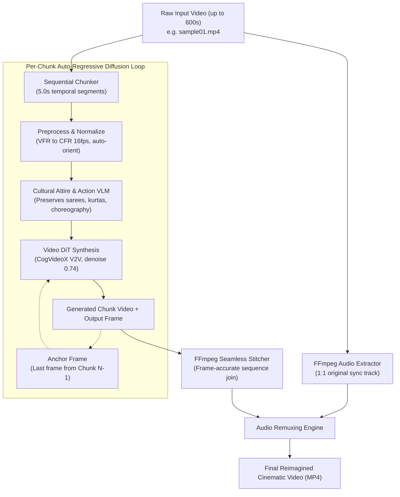

# Vajan (वजन)

**Vajan** is a 100% local, self-contained AI video generation and reimagination pipeline designed for **Vast.ai** GPU instances (featuring **NVIDIA Blackwell RTX 5090**, **RTX 4090**, and **A100/H100**). 

It takes low-resolution, candid mobile/family videos (MP4) and reimagines them into high-production cinematic films while locking human actions, gestures, and camera choreography 1:1.

---

## Key Technical Innovations

* **Dense Structural Transfer, Not Text-to-Video:**  
  Unlike text-to-video pipelines that discard spatial choreography, Vajan conditions directly on the source video latents and structural depth. Physical actions (laughing, pointing, walking, dancing) and camera pans remain strictly locked in space and timing.
* **Cultural Attire & Garment Fidelity:**  
  Guarantees cultural clothing preservation. If a subject is wearing a **saree**, it remains an authentic, elegantly draped silk or cotton saree—**never** substituted with a Western gown or dress. Kurtas remain kurtas, and casual wear remains clean, well-tailored modern apparel.
* **Auto-Regressive Frame Continuity Across Chunks:**  
  When processing long videos in 5-second segments, each chunk anchors its first frame to the final generated frame of the preceding chunk ($F_0^{(N+1)} = F_{end}^{(N)}$). This eliminates visual flicker, jump cuts, and clothing/facial morphing across chunk seams.
* **Long-Form (Up to 600s / 10 Minutes) Video Support:**  
  Processes long clips through intelligent sequential chunking, automatically extracting and preserving the original audio track 1:1, and remuxing it with the final stitched video.
* **Single Unified CLI Interface:**  
  One unified CLI handles searching GPU offers, renting instances, bootstrapping environments, monitoring jobs, syncing files, and destroying instances to stop billing.

---

## System Architecture



---

## Single CLI Interface: `vajan.py`

All operations are controlled via a single command-line interface:

```text
python vajan.py [-v VIDEO] [-c CONFIG] -a {start,stop,check,getfile,cleanup,delete} [-s STYLE]
```

### Command Flags

| Flag | Name | Required | Description |
| :--- | :--- | :--- | :--- |
| `-v` | `--video` | When starting | Path to local input video (`.mp4`) |
| `-c` | `--config` | After start | Path to session config JSON (e.g. `sample01_2609162221.json`) |
| `-a` | `--action` | **Yes** | `start`, `check`, `stop`, `getfile`, `cleanup`, `delete` |
| `-s` | `--style` | No | Artistic style preset (default: `cinematic`) |

---

## Complete CLI Workflows

### 1. Launch a New Video Generation (`-v file -a start`)
Searches available Vast.ai GPU hardware, displays the top options in a ranked table, prompts you for selection, rents the chosen GPU with a 70GB disk, syncs code, and starts background processing:

```bash
python vajan.py -v samples/sample01.mp4 -a start -s cinematic
```

**Interactive Hardware Selector:**
```text
==========================================================================================
#   OFFER_ID    GPU MODEL          VRAM    RATE        DL/UL SPEED     LOCATION           ARCH
------------------------------------------------------------------------------------------
1   50540439    1x RTX 5090        31GB    $0.269/hr   664/261M        Japan, JP          Blackwell ★
2   44155834    1x A100 PCIE       40GB    $0.268/hr   853/783M        Florida, US        Standard
3   50051530    1x RTX 4090        23GB    $0.304/hr   573/544M        Brazil, BR         Standard
4   48319246    1x RTX 5090        31GB    $0.362/hr   704/79M         Slovakia, SK       Blackwell ★
==========================================================================================

Select hardware option [1-10] (default: 1) or enter Offer ID: 1
```

> **Config Naming Rule:**  
> Automatically writes a config JSON formatted as **`<clean_video_name>_YYMMDDHHMM.json`** into `VAJAN_HOME` (default `.`), e.g., `sample01_2609162221.json`.

---

### 2. Check Generation Progress (`-c json -a check`)
Connects to the Vast.ai instance, verifies process PID status, displays real-time chunk progress, and prints the latest log output:

```bash
python vajan.py -c sample01_2609162221.json -a check
```

**Example Status Output:**
```text
===========================================================================
  VAJAN JOB STATUS: sample01
  Instance ID  : #50540439 (RTX 5090)
  Remote PID   : 28412
===========================================================================
  Instance State : RUNNING ($0.269/hr)
  Job State      : PROCESSING (Actively generating frames)
  Output Ready   : NO

--- Recent Log Output ---
  | [Plan] Processing 6.9s video in 2 sequential chunk(s)...
  | [Progress] Chunk 1/2 (50.0%) | Time: 0.0s - 5.0s
  | [Action Detected] Subjects interacting warmly in living room.
  | [VideoEngine] Starting generation: denoise 0.74, steps 32...
---------------------------------------------------------------------------
```

---

### 3. Download the Finished Video (`-c json -a getfile`)
Checks whether the reimagined video is ready on the server. If ready, downloads the MP4 and metadata JSON to `./outputs/` (or `$VAJAN_HOME/outputs/`). If not ready, informs you of current progress:

```bash
python vajan.py -c sample01_2609162221.json -a getfile
```

---

### 4. Stop the Running Job (`-c json -a stop`)
Safely stops the active video diffusion process without destroying the instance:

```bash
python vajan.py -c sample01_2609162221.json -a stop
```

---

### 5. Clean Up Server Scratch Data (`-c json -a cleanup`)
Deletes temporary video chunks and raw inputs from `/workspace/vajan/` to free disk space, while **preserving installed packages and downloaded model weights**:

```bash
python vajan.py -c sample01_2609162221.json -a cleanup
```

---

### 6. Re-use Existing Instance for a New Video (`-c json -a start -v new_file`)
Avoids the overhead of renting and bootstrapping a new instance by re-using the existing setup:
* **Safety Lock:** If the previous process is still running, **it refuses to run** to prevent GPU VRAM collisions.
* If idle, it writes a **new** config JSON (`<new_video>_YYMMDDHHMM.json`), uploads the new video, and starts generation immediately.

```bash
python vajan.py -c sample01_2609162221.json -a start -v samples/another_video.mp4
```

---

### 7. Permanently Delete Instance & Stop Billing (`-c json -a delete`)
Kills any remote processes and permanently terminates the Vast.ai instance. **Never fails; always succeeds in stopping billing:**

```bash
python vajan.py -c sample01_2609162221.json -a delete
```

---

## Environment & Configuration

### Vast.ai API Key
The CLI automatically loads your Vast.ai API key from:
1. `VASTAI_KEY` or `VAST_API_KEY` environment variables.
2. Local `.env.local` or `.env` files.
3. Sibling project `.env.local` (e.g. `../bahiranan/.env.local`).
4. `~/.vast_api_key`.

### `VAJAN_HOME` Directory
Set `VAJAN_HOME` to control where session JSON configs and downloaded video outputs are stored:

```bash
export VAJAN_HOME="/path/to/my_workspace"
```
*(Defaults to current working directory `.` if unset).*

---

## Hardware Benchmarks: Compute Time per 1 Minute of Video

| Configuration | Compute Time for 1 Min Video (~14 chunks) | Cost per Minute of Video on Vast.ai |
| :--- | :--- | :--- |
| **CogVideoX-5B on 1x RTX 5090 (Blackwell 32GB)** | **~7.5 – 9.0 minutes** | **~$0.05** |
| **CogVideoX-5B on 1x A100 (80GB SXM)** | **~7.0 – 8.5 minutes** | **~$0.18** |
| **CogVideoX-5B on 1x RTX 4090 (24GB w/ offload)** | **~18 – 23 minutes** | **~$0.15** |
| **Wan2.1 (14B FP8) on 1x RTX 5090 (Blackwell 32GB)** | **~19 – 22 minutes** | **~$0.12** |

---

## Project Structure

```text
vajan/
├── vajan.py                  # Primary single CLI entrypoint (start, check, stop, etc.)
├── run.py                    # Universal runner (routes to vajan.py or run_engine.py)
├── run_engine.py             # Server-side background execution engine
├── config.yaml               # System parameters & aesthetic style palettes
├── requirements.txt          # Deep learning & video dependencies
├── .env.local                # Local Vast.ai credentials (gitignored)
├── samples/
│   └── sample01.mp4          # Low-resolution sample mobile video
├── scripts/
│   ├── vast_setup.sh         # One-click environment bootstrap for Vast.ai GPUs
│   └── download_models.sh    # Model weights pre-downloader
└── src/
    ├── analyzer/
    │   ├── video_preprocessor.py  # Orientation fix, VFR->CFR, CLAHE contrast
    │   └── vlm_captioner.py       # Attire & choreography analyzer (Qwen-VL)
    ├── cloud/
    │   └── vast_client.py         # Lightweight sovereign Vast.ai API client
    ├── generator/
    │   └── video_engine.py        # Frame-anchored Video DiT synthesis engine
    └── pipeline.py                # Long-form chunking, continuity & audio remuxer
```
